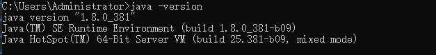
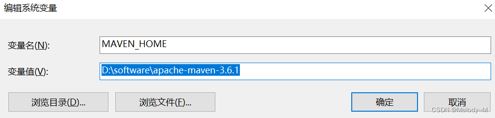
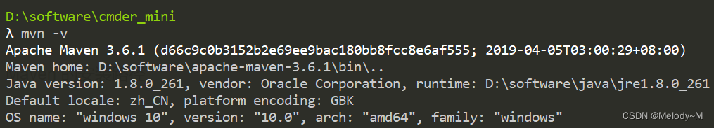

# 
# Maven 介绍
- Maven 是 Apache 下的一个纯 Java 开发的开源项目

- Maven 是一个项目管理工具，可以对 Java 项目进行构建、依赖管理

- Maven 也可被用于构建和管理各种项目，例如 C#，Ruby，Scala 和其他语言编写的项目

- Maven它提供了中央仓库，能帮我们自动下载构件

- Maven仓库就是放置所有JAR文件（WAR，ZIP，POM等等）的地方，所有Maven项目可以从同一个Maven仓库中获取自己所需要的依赖JAR，这节省了磁盘资源

- 由于Maven仓库中所有的JAR都有其自己的坐标，该坐标告诉Maven它的组ID，构件ID，版本，打包方式等等，因此Maven项目可以方便的进行依赖版本管理

# Maven 安装
## 1，maven依赖于java，需先安装java环境

打开控制台，执行 java -version 确认本地已安装成功

## 2.下载Maven安装文件

官网地址： https://maven.apache.org/download.cgi

## 3.配置环境变量

添加环境变量MAVEN_HOME，值为 Maven 的安装路径

## 4.检测安装成功
执行mvn -v命令，若输出类似下面的 maven 版本信息，说明配置成功 

