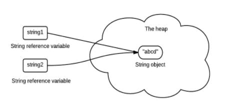

# 数据类型
## 包装类型
八个基本类型:

- boolean/1
- byte/8
- char/16
- short/16
- int/32
- float/32
- long/64
- double/64

基本类型都有对应的包装类型，基本类型与其对应的包装类型之间的赋值使用自动装箱与拆箱完成。

```java
Integer x = 2;     // 装箱
int y = x;         // 拆箱
```
## 缓存池
new Integer(123) 与 Integer.valueOf(123) 的区别在于:

- new Integer(123) 每次都会新建一个对象
- Integer.valueOf(123) 会使用缓存池中的对象，多次调用会取得同一个对象的引用。
```java
Integer x = new Integer(123);
Integer y = new Integer(123);
System.out.println(x == y);    // false
Integer z = Integer.valueOf(123);
Integer k = Integer.valueOf(123);
System.out.println(z == k);   // true
```
valueOf() 方法的实现比较简单，就是先判断值是否在缓存池中，如果在的话就直接返回缓存池的内容。
```java
public static Integer valueOf(int i) {
    if (i >= IntegerCache.low && i <= IntegerCache.high)
        return IntegerCache.cache[i + (-IntegerCache.low)];
    return new Integer(i);
}
```
在 Java 8 中，Integer 缓存池的大小默认为 -128~127。

```java
static final int low = -128;
static final int high;
static final Integer cache[];

static {
    // high value may be configured by property
    int h = 127;
    String integerCacheHighPropValue =
        sun.misc.VM.getSavedProperty("java.lang.Integer.IntegerCache.high");
    if (integerCacheHighPropValue != null) {
        try {
            int i = parseInt(integerCacheHighPropValue);
            i = Math.max(i, 127);
            // Maximum array size is Integer.MAX_VALUE
            h = Math.min(i, Integer.MAX_VALUE - (-low) -1);
        } catch( NumberFormatException nfe) {
            // If the property cannot be parsed into an int, ignore it.
        }
    }
    high = h;

    cache = new Integer[(high - low) + 1];
    int j = low;
    for(int k = 0; k < cache.length; k++)
        cache[k] = new Integer(j++);

    // range [-128, 127] must be interned (JLS7 5.1.7)
    assert IntegerCache.high >= 127;
}
```
编译器会在缓冲池范围内的基本类型自动装箱过程调用 valueOf() 方法，因此多个 Integer 实例使用自动装箱来创建并且值相同，那么就会引用相同的对象。
```java
Integer m = 123;
Integer n = 123;
System.out.println(m == n); // true
```
基本类型对应的缓冲池如下:
- boolean values true and false
- all byte values
- short values between -128 and 127
- int values between -128 and 127
- char in the range \u0000 to \u007F
  
在使用这些基本类型对应的包装类型时，就可以直接使用缓冲池中的对象。

如果在缓冲池之外：
```java
Integer m = 323;
Integer n = 323;
System.out.println(m == n); // false
```
## String
### 概览
String 被声明为 final，因此它不可被继承。

内部使用 char 数组存储数据，该数组被声明为 final，这意味着 value 数组初始化之后就不能再引用其它数组。并且 String 内部没有改变 value 数组的方法，因此可以保证 String 不可变。
```java
public final class String
    implements java.io.Serializable, Comparable<String>, CharSequence {
    /** The value is used for character storage. */
    private final char value[];
```
### 不可变的好处
1. 可以缓存 hash 值

因为 String 的 hash 值经常被使用，例如 String 用做 HashMap 的 key。不可变的特性可以使得 hash 值也不可变，因此只需要进行一次计算。

2. String Pool 的需要

如果一个 String 对象已经被创建过了，那么就会从 String Pool 中取得引用。只有 String 是不可变的，才可能使用 String Pool。



3. 安全性

String 经常作为参数，String 不可变性可以保证参数不可变。例如在作为网络连接参数的情况下如果 String 是可变的，那么在网络连接过程中，String 被改变，改变 String 对象的那一方以为现在连接的是其它主机，而实际情况却不一定是。

4. 线程安全

String 不可变性天生具备线程安全，可以在多个线程中安全地使用。

### String, StringBuffer and StringBuilder
1. 可变性

