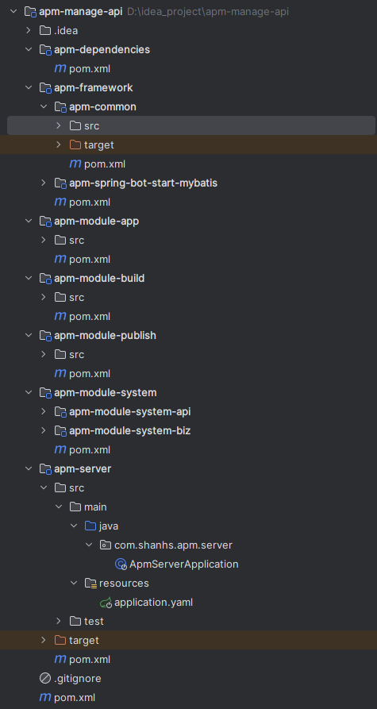

# 1.基础架子结构


# 1.创建跟项目

- 根项目只有一个pom.xml文件,将packaging设置为pom,只做工程管理,管理所有子模块
```xml
<?xml version="1.0" encoding="UTF-8"?>
<project xmlns="http://maven.apache.org/POM/4.0.0"
         xmlns:xsi="http://www.w3.org/2001/XMLSchema-instance"
         xsi:schemaLocation="http://maven.apache.org/POM/4.0.0 http://maven.apache.org/xsd/maven-4.0.0.xsd">
    <modelVersion>4.0.0</modelVersion>
    <groupId>com.shanhs</groupId>
    <artifactId>apm-manage-api</artifactId>
    <version>${revision}</version>
    <packaging>pom</packaging>
    <modules>
        <module>apm-module-system</module>
        <module>apm-framework</module>
        <module>apm-dependencies</module>
        <module>apm-module-build</module>
        <module>apm-module-publish</module>
        <module>apm-module-app</module>
        <module>apm-server</module>
        <module>apm-framework/apm-spring-bot-start-mybatis</module>
        <module>apm-framework/apm-common</module>
    </modules>
    <name>${project.artifactId}</name>
    <description>app管理</description>
    <properties>
        <revision>1.0-SNAPSHOT</revision>
        <java.version>1.8</java.version>
        <maven.compiler.source>${java.version}</maven.compiler.source>
        <maven.compiler.target>${java.version}</maven.compiler.target>
        <maven-surefire-plugin.version>3.0.0-M5</maven-surefire-plugin.version>
        <maven-compiler-plugin.version>3.8.1</maven-compiler-plugin.version>
        <flatten-maven-plugin.version>1.5.0</flatten-maven-plugin.version>
        <lombok.version>1.18.30</lombok.version>
        <spring.boot.version>2.7.17</spring.boot.version>
        <mapstruct.version>1.5.5.Final</mapstruct.version>
        <project.build.sourceEncoding>UTF-8</project.build.sourceEncoding>
    </properties>
    <dependencyManagement>
        <dependencies>
            <dependency>
                <groupId>com.shanhs</groupId>
                <artifactId>apm-dependencies</artifactId>
                <version>${revision}</version>
                <type>pom</type>
                <scope>import</scope>
            </dependency>
        </dependencies>
    </dependencyManagement>

</project>
```
